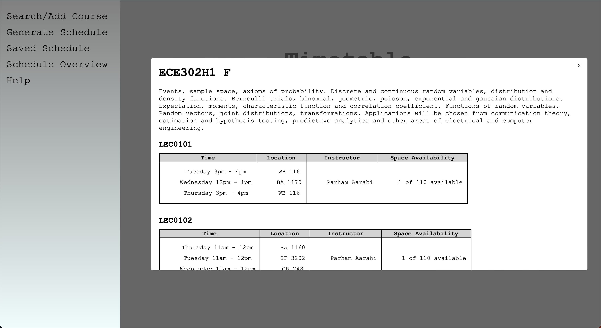
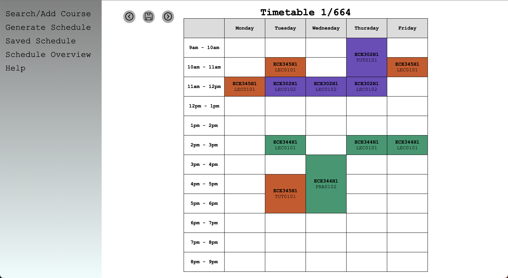

# UofT Timetable Generator

The frontend is developed using a combination of JavaScript, HTML/CSS, while the backend is powered by Node.js.

# FrontEnd
## Main Page

### Searching
- Entering the course code in the search box will send an API request to the server side.
- The server side will then check whether the course code is valid. If it is not valid it will send a 404 error which will not add the course to your course list.
- If multiple results are found, the server will return a list of all the matching courses. The user can then select one of these courses and then the server will retreive the information for that course.

- If only one result was found, the course will automatically be added to your course list.
### Adding Filters
- The user can add the faculty and session for the search.

### Excluding Sections
- The user can exclude the sections they do not want to include.
- It will be displayed if the section is full or there is a waitlist.

### Adding Preferences
### Course Descriptions
- If the user clicks on one of the courses from the course list, the course description will show up.
- This includes an overview of the course and a detailed list of each course section.

## Generating Schedules
- After adding the courses, the user can generate all the possible schedules.
- The user can naviate through the courses by either clicking on the arrow buttons or pressing the arrow keys on the keyboard.
- The user can also save their desired schedule for future viewing. Pressing the enter key is the keyboard shortcut for this action.

## Checking Saved Schedules

## Overview of All Schedules

# BackEnd