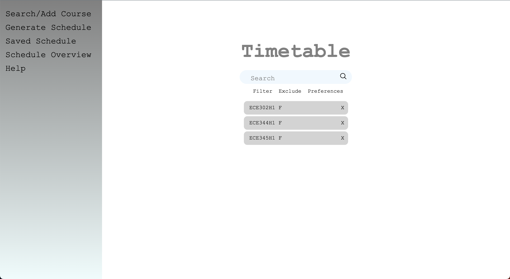
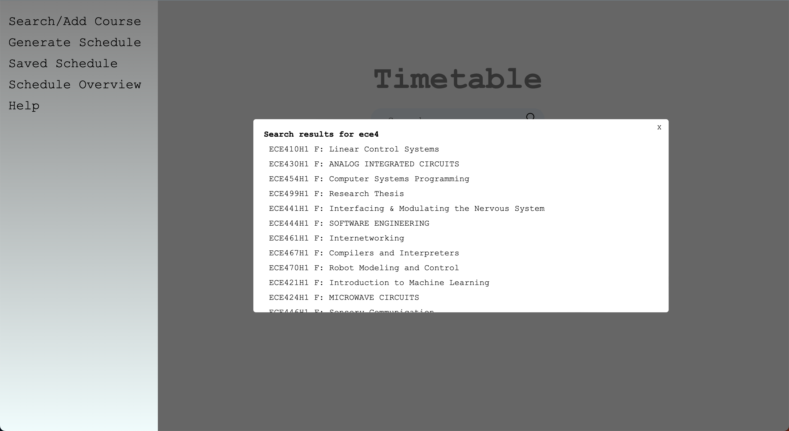
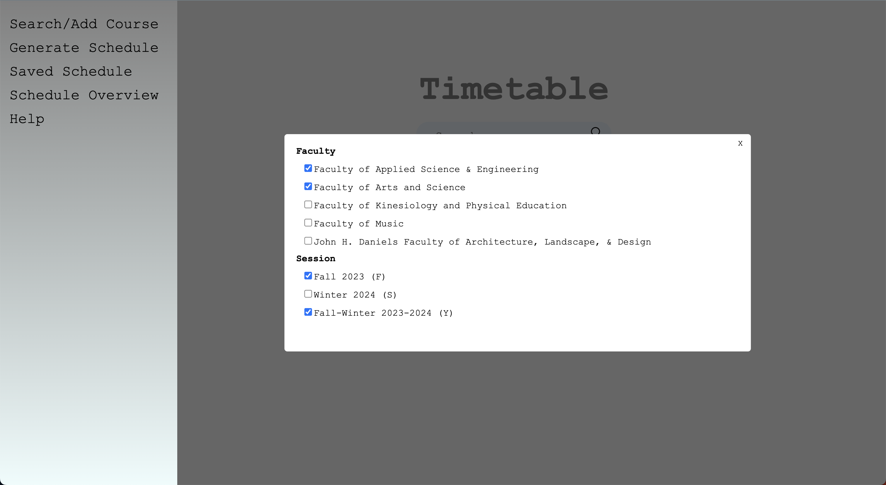
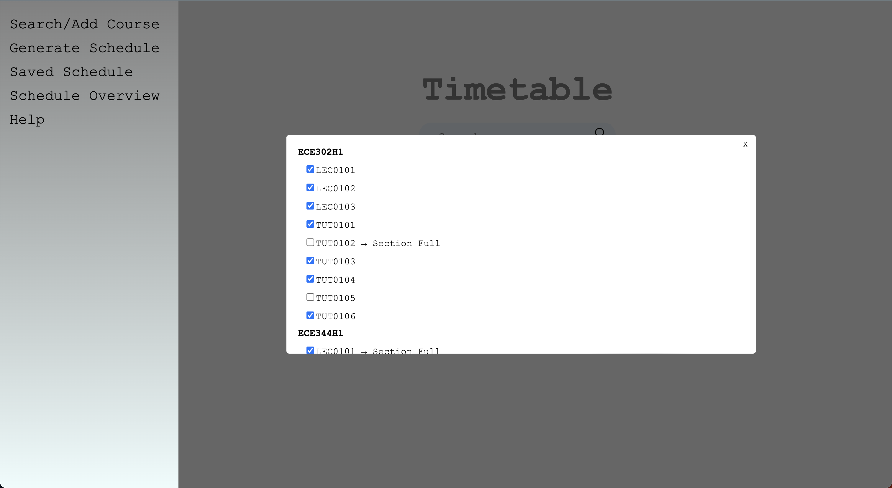

# UofT Timetable Generator

The frontend is developed using a combination of JavaScript, HTML/CSS, while the backend is powered by Node.js.

# FrontEnd
## Main Page

### Searching
- Entering the course code in the search box will send an API request to the server side.
- The server side will then check whether the course code is valid. If it is not valid it will send a 404 error which will not add the course to your course list.
- If multiple results are found, the server will return a list of all the matching courses. The user can then select one of these courses and then the server will retreive the information for that course.

- If only one result was found, the course will automatically be added to your course list.
### Adding Filters
- The user can add the faculty and session for the search.

### Excluding Sections
- The user can exclude the sections they do not want to include.

### Adding Preferences
### Clearing Results
### Course Descriptions

## Generating Schedules
### Navigating Through All Schedules
### Saving Schedules

## Checking Saved Schedules
### Navigating Saved Schedules
### Deleting Saved Schedules

## Overview of All Schedules
### Navigating
### Saving Schedules

# BackEnd