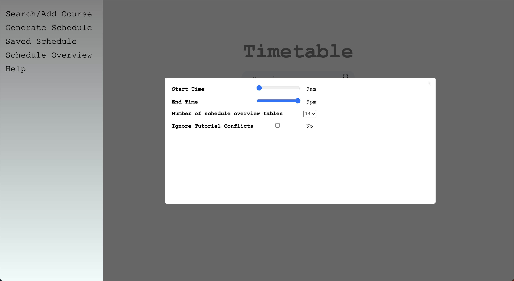
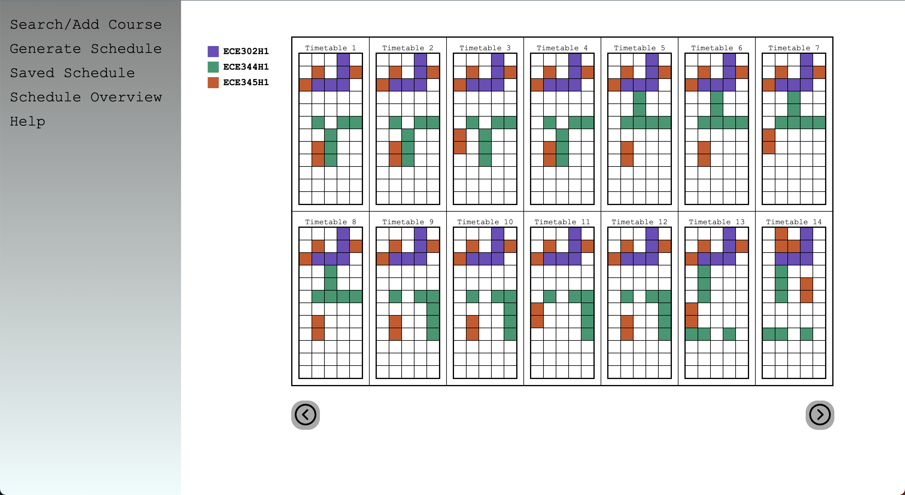
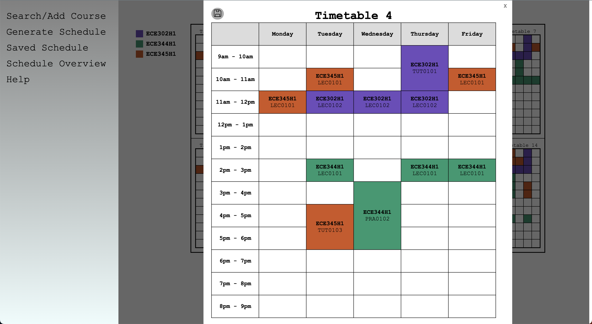

# UofT Timetable Generator

The frontend is developed using a combination of JavaScript, HTML/CSS, while the backend is powered by Node.js.

# FrontEnd
## Main Page

### Searching
- Entering the course code in the search box will send an API request to the server side.
- The server side will then check whether the course code is valid. If it is not valid it will send a 404 error which will not add the course to your course list.
- If multiple results are found, the server will return a list of all the matching courses. The user can then select one of these courses and then the server will retreive the information for that course.

- If only one result was found, the course will automatically be added to your course list.
### Adding Filters
- The user can add the faculty and session for the search.

### Excluding Sections
- The user can exclude the sections they do not want to include.
- It will be displayed if the section is full or there is a waitlist.

### Adding Preferences
- The user can add preferences to the schedules, such as start/end time, number of schedules in schedule overview and whether they do not mind tutorial conflicts.

### Course Descriptions
- If the user clicks on one of the courses from the course list, the course description will show up.
- This includes an overview of the course and a detailed list of each course section.

## Generating Schedules
- After adding the courses, the user can generate all the possible schedules in the Generate Schedule tab.
- The user can naviate through the courses by either clicking on the arrow buttons or pressing the arrow keys on the keyboard.
- The user can also save their desired schedule for future viewing. Pressing the enter key is the keyboard shortcut for this action.

## Checking Saved Schedules
- If the user saved schedules, they can view it in the Saved Schedule tab.
- Navigating is the same as above.
- If the user wishes to delete a saved schedule from the list, they can simply press the trash bin icon or press the backspace key.

## Overview of All Schedules
- If the user wants a bigger overview of the generated schedules, they can view it in the Schedule Overview tab.
- They can naviate through the schedules with the same method mentioned above.
- This generates a number of schedules on the same page. The number of generated schedules can be modified in the preferences page.

- To view each schedule in more detail, the user can click on the schedule.

# BackEnd
- When the user inputs a course code, this sends a request to the server side.
- The server side then gets a list of matching courses.
- If there are multiple matching courses, the server will return the list of matching courses and when the user chooses the course they want, it will then send another request to the server side.
- The server side will then parse the course information, which has course code, course time, course description, course instructors, etc.
- If there was only one matching course, they server will parse the course information and return it.